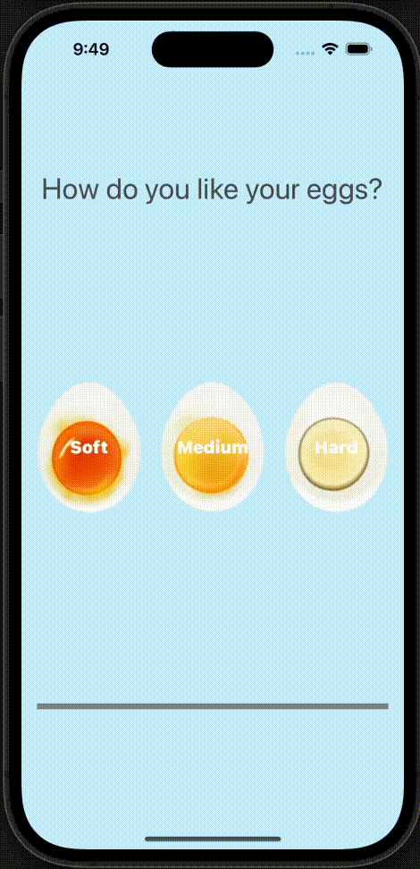

# Egg Timer

An egg timer app to boil your eggs to perfection depending on how you prefer your eggs.

## Technical Points

- Swift timer API
- Using the ProgressView
- Organization of app assets: images
- Swift collection types: dictionaries; functions
- Conditional statements: if/else/switch and flow control code

